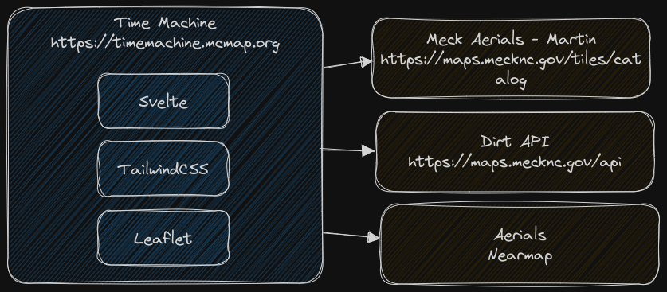

# Mecklenburg County Time Machine

Mecklenburg County's Time Machine is a public-facing raster imagery viewer, built with [Svelte](https://svelte.dev/), [TailwindCSS](https://tailwindcss.com/), and [Leaflet](https://leafletjs.com/). The development and build environment is [Vite](https://vitejs.dev/).

Site: [https://maps.mecklenburgcountync.gov/timemachine](https://maps.mecklenburgcountync.gov/timemachine)

## Architecture



Time machine can draw any `z/x/y` raster tiles.

Time Machine defines aerials in `src/assets/surveys.json` and overlay layers in `src/assets/overlays.js`. If you are a NearMap customer with an api key, you can create a `.env` file in the root project folder and create a variable like this:

```.env
VITE_NEARTOKEN=your_key
```

Surveys from NearMap will be integrated with your own aerials defined in `src/assets/surveys.json`.

## Using the project

[Node.js](https://nodejs.org/en) is required to run the development and build systems, and [git](https://git-scm.com/) is required to use the versioning system.

### Clone the project
```bash
git clone https://github.com/gencharitaci/timemachine
```

### Install dependencies
```bash
cd timemachine
npm install
```

### Start the development server
```bash
npm run dev
```

Navigate a web browser to [http://localhost:3000](http://localhost:3000) to view the HMR live development server.

### Build for production
```bash
npm run build
```

After the build is complete, copy the contents of the `dist` folder to the production web server.
